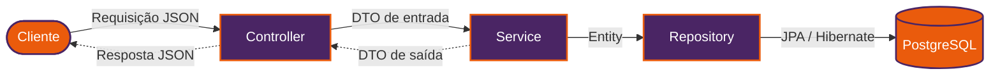

<!-- ============ BANNER ============ -->


<!-- ============ DIGITAÇÃO ============ -->
<div align="center">
  <a href="https://github.com/vittoralemao">
    
  </a>
</div>

<!-- ============ CONTATOS ============ -->
<div align="center">
  <a href="https://www.linkedin.com/in/vitoralemao" target="_blank"></a>
  <a href="mailto:contato.vitoralemao@gmail.com"></a>
  
</div>

<br>

## `SobreMim.java`

```java
public class SobreMim {

    private final String nome        = "Vitor Hugo";
    private final String cargo       = "Desenvolvedor Back-end Java";
    private final String[] stack     = {"Java", "Spring Boot", "Spring Data JPA", "PostgreSQL", "Docker"};
    private final String aprendendo  = "Spring Security (JWT) e Spring Cloud / AWS";
    private final String idiomas     = "Português 🇧🇷 | English (learning) 🇺🇸";

    public String filosofia() {
        return "Se alguém teve o esforço de construir, eu consigo ter o esforço de aprender.";
    }
}
```

## `Stack`

<div align="center">

**Linguagem & Frameworks**


**Banco de Dados & Infra**


**Ferramentas**


</div>

## `Projeto em destaque`

> API RESTful de gerenciamento de biblioteca, construída camada por camada para dominar o ecossistema Spring de ponta a ponta: da persistência à segurança e ao deploy na nuvem.

🔗 **[Ver repositório](https://github.com/vittoralemao/biblioteca)**

### `Arquitetura`



<!-- ============ RODAPÉ ============ -->

